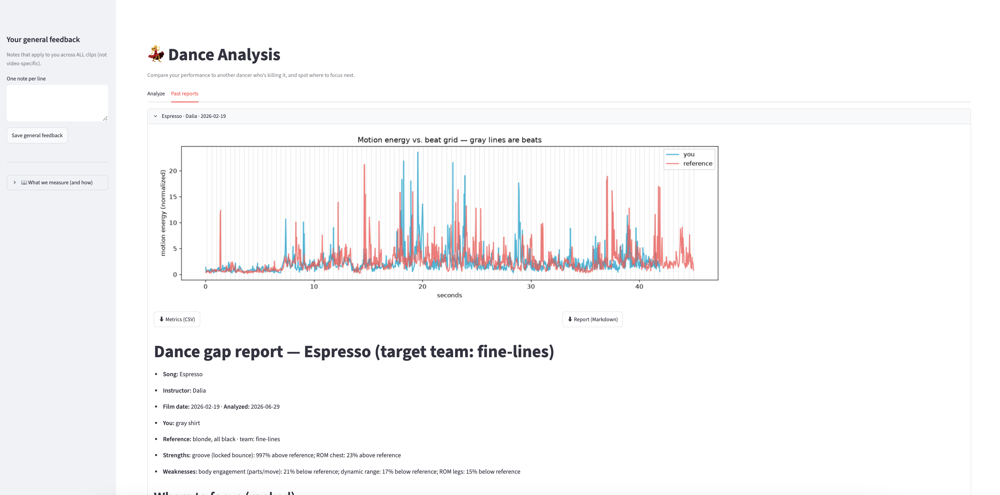
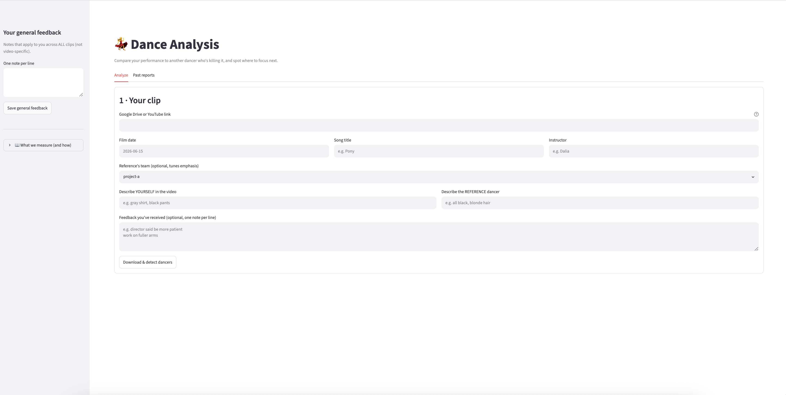

# dance-analysis

A pose + audio pipeline for comparing your performance against that of another dancer you
admire, quantifying the gaps that actually matter.



## Quick start

Needs Python 3 and works on macOS / Linux (`setup.sh` installs ffmpeg via Homebrew or apt).
First run downloads the pose model (~6 MB).

```
git clone https://github.com/lisasiva/dance-analysis
cd dance-analysis
./setup.sh      # installs everything (and ffmpeg) — first run takes a few minutes
./run.sh        # opens the app in your browser at http://localhost:8501/
```

## What dance-analysis measures

- **Pocket** — when you *initiate* movement relative to the beat (after = patient/in the pocket, before = rushing).
- **Timing** — accent placement vs. the reference, and how consistent.
- **Range of motion / line & extension** — per body region (head, shoulders, chest, hips, arms, legs).
- **Sharpness / attack** — how crisply you hit and freeze.
- **Fluidity** — sustained, gooey movement vs. hit-and-freeze.
- **Dynamic range** — big moves big, stillness still.
- **Groove** — bounce / weight-shift, and whether it locks to the beat.
- **Body engagement** — how many body parts you fire in a single move ("filling it up").
- **Sync** — how closely you match the reference's shape. *Low priority — your own style is fine.*

## How it works

You give it **one video containing both you and the reference dancer** doing the same
routine (same camera, same music). Because it's a single clip, timing and motion compare
directly — no guesswork about aligning two separate recordings. The app detects everyone in
frame; you tell it which dancer is you and which is the reference, and it scores the gap.



## Pipeline stages

```
ingest  ->  pose      ->  beats     ->  compare        ->  report
(Drive/     (YOLO11    (librosa      (normalize +         (metrics +
 YouTube)    -pose +     beat grid)    align + metrics)     gap ranking)
            tracking)
```


## Layout

```
app.py            the local Streamlit UI (main entry point)
src/dance_analysis/
  config.py       paths + constants (COCO keypoints, metric weights)
  ingest.py       Google Drive / YouTube -> data/raw
  pose.py         video -> tracked keypoints  (YOLO11-pose + ByteTrack)
  audio.py        video -> beat grid          (librosa)
  align.py        scale-normalize, time-window, mirror
  metrics.py      angles, speed, sharpness, pocket, groove, engagement, ROM, sync
  report.py       metrics -> ranked markdown gap report
  store.py        per-clip metrics CSV export
  visualize.py    skeleton overlays + metric plots
  cli.py          command-line entry point (advanced; the UI covers normal use)
data/raw/         downloaded clips
data/processed/   pose + beat artifacts
data/reports/     output per clip
```

## Future Improvements

* Show summary in sidebar of key metrics to focus on now, based on most recent reports
* Generate a training plan to improve key metrics